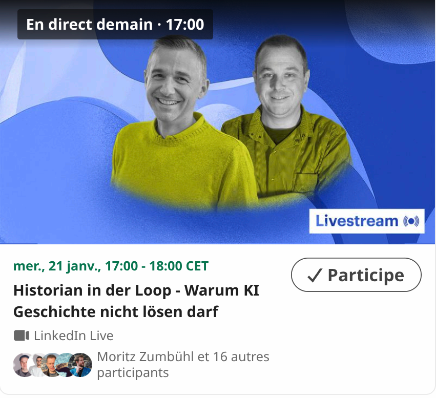

KI ist kein Historiker. Und sollte es auch nicht werden.  
Trotzdem wird sie unverzichtbar.  
  

<https://www.linkedin.com/events/7414571629101576192/>

Folien:
- <https://gbottazzoli.github.io/Historian-in-der-Loop---Warum-KI-Geschichte-nicht-l-sen-darf---Webinar/>
- oder [<https://github.com/gbottazzoli/Historian-in-der-Loop---Warum-KI-Geschichte-nicht-l-sen-darf---Webinar/blob/gh-pages/09-diskussion-graph-bewahrt-llm-glaettet-slide.md>](https://github.com/gbottazzoli/Historian-in-der-Loop---Warum-KI-Geschichte-nicht-l-sen-darf---Webinar/blob/gh-pages/index.md)

---

[Index](index.html) · [Wer war Elisabeth Müller?](02-wer-war-elisabeth-mueller-slide.html) →

<small>Lizenz: [CC BY-NC-SA 4.0](https://creativecommons.org/licenses/by-nc-sa/4.0/)</small>
