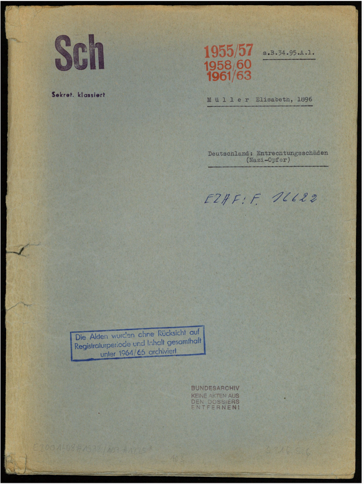
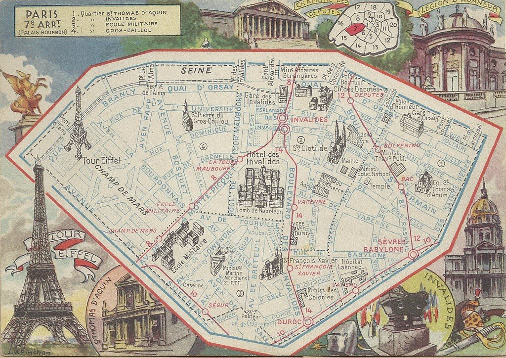
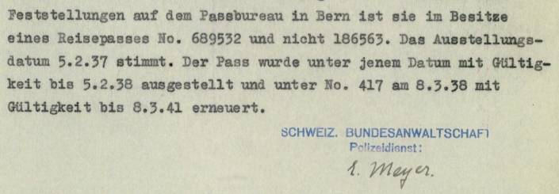

### 1. Aktendeckel Dossier BAR

**Quelle**: Schweizerisches Bundesarchiv, E4320B#1987/187#1705*, Elisabeth Müller, 1896, 1987/00187 Bundesanwaltschaft (Bern) (1908-1980), konsultiert 2025.

> **Kontext**: "Müller Elisabeth, 1896" — Sekret. klassiert. Nazi-Opfer. Dieses Aktencouvert bezieht sich auf die Arbeit der Kommission für Vorauszahlungen an schweizerische Opfer der nationalsozialistischen Verfolgung ab den 50er Jahren.

---

### 2. Plan Avenue Duquesne (Postkarte, ohne Datum)

**Quelle**: <https://www.cparama.com/forum/cartes2016/1476177866-RParis1-001.jpg> — PARIS (VII°) - Avenue Duquesne bis Avenue Lowendal. Verlag: F. Fleury - Collection Guichard. Ungeprüft, visuell auf einem Forum gepostet ohne Copyright-Merkmale.

> Hier ist eine der bekannten Adressen Elisabeth Müllers in Paris: Hotel Derby.

---

### 3. Plan Avenue Duquesne (1946)

**Quelle**: <https://www.cparama.com/forum/viewtopic.php?f=141&t=7835> Ungeprüft, visuell auf einem Forum gepostet ohne Copyright-Merkmale.

> **Kontext**: Hotel Derby, Avenue Duquesne, 7. Arrondissement — gegenüber der Ecole Militaire. Die Ecole Militaire wird 1941 durch die deutschen Truppen besetzt. Elisabeth ist dann bereits im Gefängnis.

---

### 4. Bundesanwaltschaft — Identitätsfeststellung (1941)

**Quelle**: Schweizerisches Bundesarchiv, E4320B#1987/187#1705*, Elisabeth Müller, 1896

> **Kontext**: Passnummer-Verwirrung. Konsulat: 186563. Bern: 689532. Der gültige Pass ist im März 1941 abgelaufen.

---

### 5. Karte Haftorte (1941 - 1945)

**Quelle**: Koordinaten aus Obsidian Vault (Metadaten entities), durch Claude Code in CSV umgewandelt und in <https://kepler.gl/> eingegeben.

**Disclaimer**: Die Karte im Hintergrund ist keine historische Karte, sie dient nur der Veranschaulichung des Verfolgungswegs.

> Kontext: 1496 Tage Haft — 4 Jahre, 1 Monat. 1945 von den "Russen" befreit.

---

---

← [Historian in der Loop ...](01-historian-in-der-loop-warum-ki-geschichte-nicht-loesen-darf-slide.html) · [Index](index.html) · [Tech-Kontext, mein Weg...](03-tech-kontext-mein-weg-zum-loop-slide.html) →

<small>Lizenz: [CC BY-NC-SA 4.0](https://creativecommons.org/licenses/by-nc-sa/4.0/)</small>
