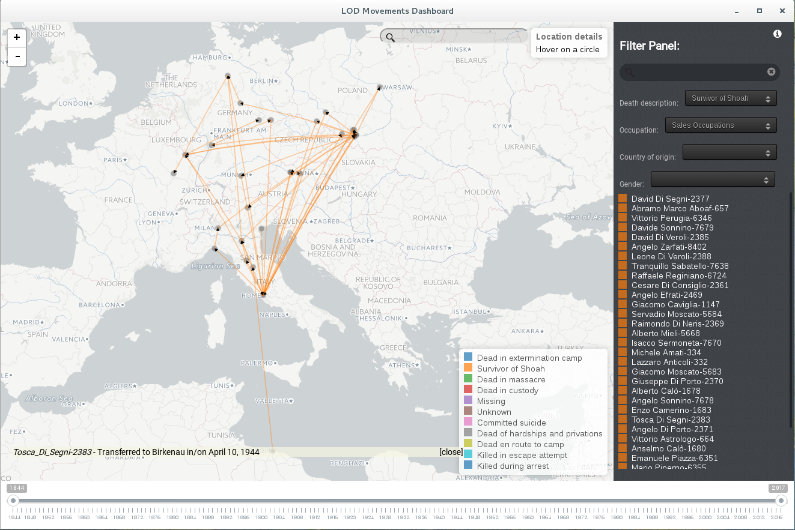
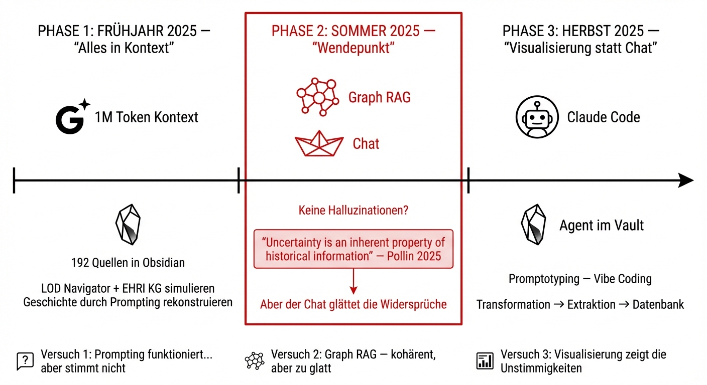

## 1. Inspiration: LOD Navigator & EHRI KG

Bildquelle: [doi.org/10.6092/issn.2532-8816/9050](http://doi.org/10.6092/issn.2532-8816/9050)

> ℹ️ **LOD Navigator**
> **Inspiration:** Netzwerke von Personen, Orten, Organisationen.
> **Ziel:** Aus den Geschichten anderer Frauen die Lücken bei Elisabeth füllen.
>
> 🎬 [Video](https://www.youtube.com/watch?v=OxGob8INbtM) · 📄 [Paper](https://umanisticadigitale.unibo.it/article/download/9050/8948?inline=1)

> ℹ️ **EHRI Knowledge Graph**
> **Inspiration:** 350'000 Archivbeschreibungen aus 59 Ländern.
> Ziel: Komplexe Queries, weil die Metadaten verbunden sind, "hidden" path finden.
>
> 🎬 [Video](https://www.youtube.com/watch?v=g8md3ZomGZU) · 🔗 [EHRI-KG](https://ehri-kg.ehri-project.eu/)

---

## 2. KI-Workflow - "3 Versuche"

> 📋 **Mein Weg zum Historian-in-the-Loop**
> 
>
> <small>Generiert mit Nano Banana Pro · Prompting aus Notizen via Claude Code</small>

> 💡 **Starter Kit Vibe Coding**
> 🟣 [Obsidian](https://obsidian.md/)
> 🔌 [Plugin Agent Client (via BRAT)](https://rait-09.github.io/obsidian-agent-client/)

---

## 3. Die Erleuchtung! — Pollin-Zitat

> 💬 **Christopher Pollin, 2025**
> # "Uncertainty is an inherent property of historical information."
>
> — Kapitel 3.2.4, S. 38

> 📄 **Unsicherheit manifestiert sich als...**
> - **vagueness** — Unschärfe
> - **inconsistency** — Widersprüche
> - **incompleteness** — Lücken
> - **polyvalence** — Mehrdeutigkeit
> - **negation** — Verneinung
>
> 📖 [Dissertation lesen](http://unipub.uni-graz.at/obvugrhs/12127700)

🔗 [Christopher Pollin auf LinkedIn](https://www.linkedin.com/in/christopher-pollin-463b0a204/)
☕ [Digital Humanities Craft auf Patreon](https://patreon.com/DigitalHumanitiesCraft)

---

## 4. Webinar — Programm

> 📄 **Webinar-Struktur**
>

| | Block | Inhalt |
|---|-------|--------|
| 📖 | **Narrativ 1** | Wer ist Elisabeth Müller? |
| 🔧 | **Demo 1** | Datentransformation, Extraktion, Enrichment → Knowledge Graph |
| 📖 | **Narrativ 2** | Was passiert mit Elisabeth? |
| 🔧 | **Demo 2** | Datenabfrage, Forschen, Visualisieren — Vibe Coding / Promptoprompting |
| 📖 | **Narrativ 3** | Ende der Geschichte ? |
| 💬 | **Diskussion** | LLM-Bias und die Problematik mit Chatbots |

---

> 💡 **Akronyme**

| Akronym | Bedeutung |
|---------|-----------|
| LOD | Linked Open Data |
| EHRI | European Holocaust Research Infrastructure |
| KG | Knowledge Graph |
| RAG | Retrieval-Augmented Generation |
| NLP | Natural Language Processing |
| LLM | Large Language Model |

> ❓ **Was ist Graph RAG?**
> **Graph RAG** = Knowledge Graph + Retrieval-Augmented Generation
>
> 1. **Daten** werden als Knoten und Beziehungen in einem Graphen gespeichert
> 2. **Retrieval** holt relevante Subgraphen basierend auf der Frage
> 3. **Generation** — ein LLM generiert Antworten aus dem abgerufenen Kontext
>
> **Versprechen:** Weniger Halluzinationen, weil Fakten im Graphen verankert sind.
> **Problem:** Der Chat glättet trotzdem Widersprüche — er sucht Kohärenz, nicht Unsicherheit.
>
>
> 📖 [RAG für historische Forschung — Humboldt-Universität Berlin](https://dhistory.hypotheses.org/11139)
> *RAG-Pipeline mit 100'000 SPIEGEL-Artikeln: Ohne gezieltes Retrieval halluzinieren LLMs trotzdem.*

---

---

← [Wer war Elisabeth Müller?](02-wer-war-elisabeth-mueller-slide.html) · [Index](index.html) · [Workflow I & II](04-workflow-i-ii-slide.html) →

<small>Lizenz: [CC BY-NC-SA 4.0](https://creativecommons.org/licenses/by-nc-sa/4.0/)</small>
