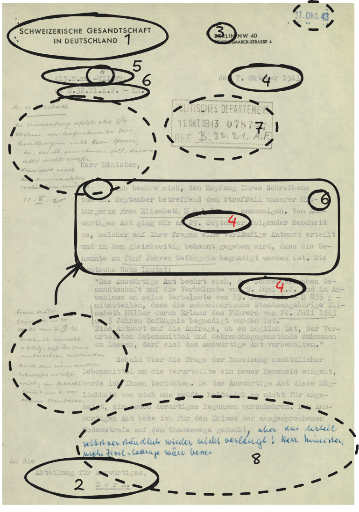
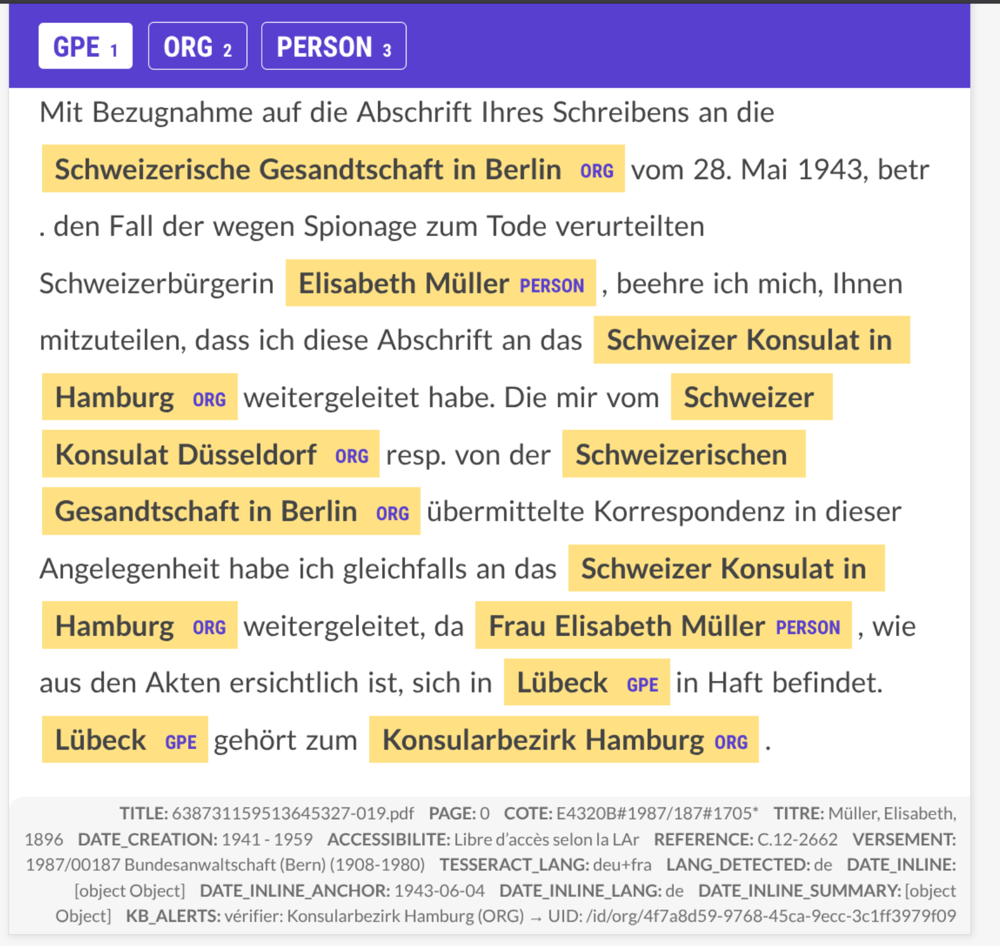
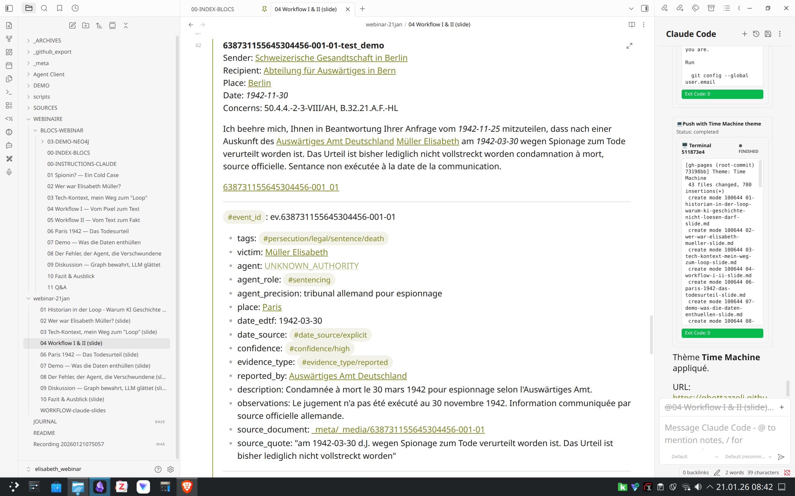
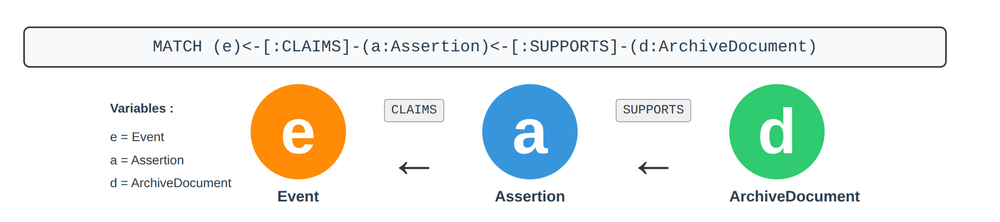
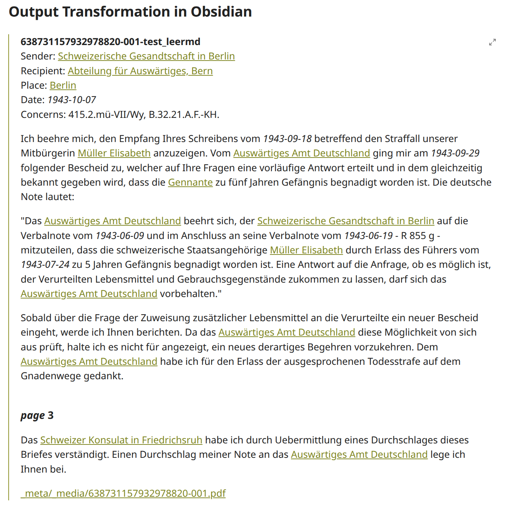
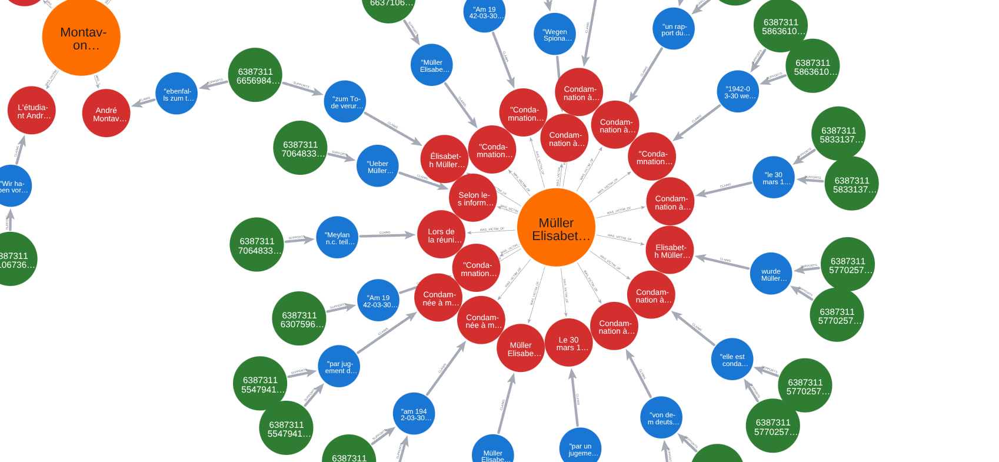

## 1 — Transformation

> "PDFs are really a bad source of truth [...] you are interested to in out of the PDF as quick as possible"
> <small>— Ines Montani (creator of spaCy & Prodigy)</small>
> <small>[Conquering PDFs: Document Understanding Beyond Plain Text](https://speakerdeck.com/inesmontani/conquering-pdfs-document-understanding-beyond-plain-text)</small>

---

> "To create a [...] model that represents the complexity of epistolary data, we first have to understand what a letter is"
> <small>— Alassi & Rosenthaler (2024)</small>

<small>Alassi Sepideh et Rosenthaler Lukas, « Semantic precision: crafting RDF-based digital editions for unveiling the layers of historical correspondence », <em>Digital Scholarship in the Humanities</em> 39 (3), 01.09.2024, pp. 813‑835. <a href="https://doi.org/10.1093/llc/fqae027">https://doi.org/10.1093/llc/fqae027</a>, consulté le 27.06.2025.</small>

---

🎬 **[Demo-Video ansehen](assets/prodigy_demo.webm)** *(Rechtsklick → "Video speichern unter..." zum Herunterladen)*

> - Lokal. Open Source. Python.
> - [Prodigy](https://prodi.gy/) (Spacy NLP Python Library); Custom Recipes in Python (OCR PDF - Docling, OCR-Korrektur - Pytesseract deu&fra)

---

> - Fine-Tuned Modell (from jsonl Spacy Daten) : XLM-RoBERTa-base
> - Dataset: 1'169 example (935 train / 234 dev), F+=92.67
> - NVIDIA GeForce RTX™ 4060 Laptop GPU
> - PERSON: 97%; GPE 91%: ORG 89%

---

## Output Transformation in Obsidian

> Aufwand: **3-4 Min/Brief → 2 Tage → Datenbank**

---

## 2 — Extraktion

> #microAction & #eventPersecution 

> Verlinkung Ereignis, Aussage und Quelle im Graph.
> Die Notiz unten zeigt das Ergebnis einer Extraktion aus einer Quelle.

- Dokumentation: [documentations/Documentation Extraction EventsActions.md](https://github.com/gbottazzoli/Flux-de-travail-num-riques-avec-mod-les-de-langage-locaux-et-Graph-RAG/blob/8dccde4e25ec5c095c5fe3324634f622be453f9a/documentations/Documentation%20Extraction%20EventsActions.md)
- Extraktionprompt: [Prompt](https://github.com/gbottazzoli/Flux-de-travail-num-riques-avec-mod-les-de-langage-locaux-et-Graph-RAG/blob/8dccde4e25ec5c095c5fe3324634f622be453f9a/prompts/PROMPT%20EXTRACTION%20v2.6%20-%20PRODUCTION%20GOLD.md)
- Python umwandlung in neo4j: [Skript](https://github.com/gbottazzoli/Flux-de-travail-num-riques-avec-mod-les-de-langage-locaux-et-Graph-RAG/blob/8dccde4e25ec5c095c5fe3324634f622be453f9a/scripts/master_import.py)

---

> Hier wird 18x das Todesurteil erwähnt. 1x mit einem anderen Datum als dem 30. März 1942 (und es ist eine Nachkriegsquelle → Admin-Fehler).
> Alle Quellen weisen auf 'reported' Information, das heisst nur rapportiert, keine Zeit das Urteil als Beweis, alle Quellen aus der Schweiz.
> Arbeiten die Schweizer blind oder vertrauen sie der Legalität der Besatzergerichte?
---

## 3 — Graph

**633 MicroActions | 241 Events | 30$**

2'347 Knoten | 9'414 Beziehungen | Lokal

---

> **Historian-in-the-Loop: Datenextraktion. Deine Forschungsfragen. Massgeschneiderter Workflow.**

---

---

← [Tech-Kontext, mein Weg...](03-tech-kontext-mein-weg-zum-loop-slide.html) · [Index](index.html) · [Paris 1942 — Das Todes...](06-paris-1942-das-todesurteil-slide.html) →

<small>Lizenz: [CC BY-NC-SA 4.0](https://creativecommons.org/licenses/by-nc-sa/4.0/)</small>
