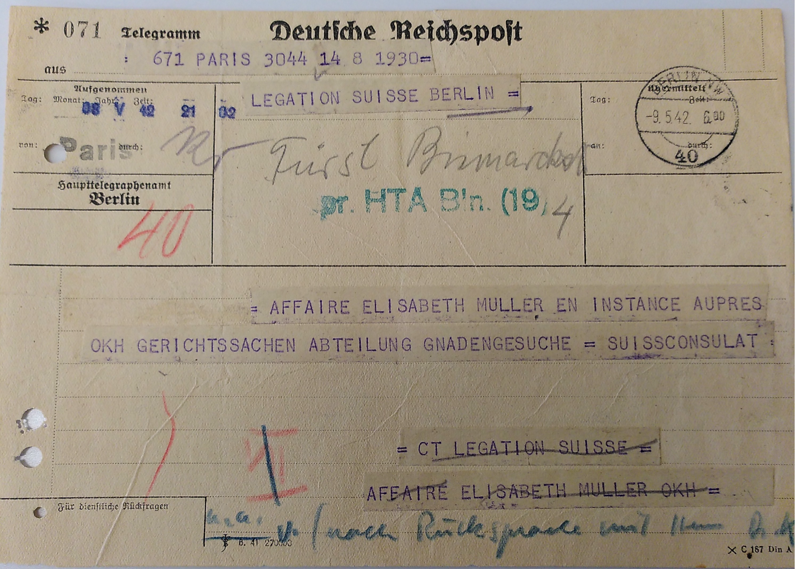
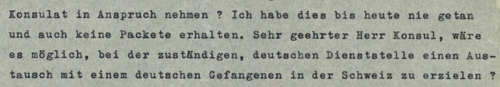
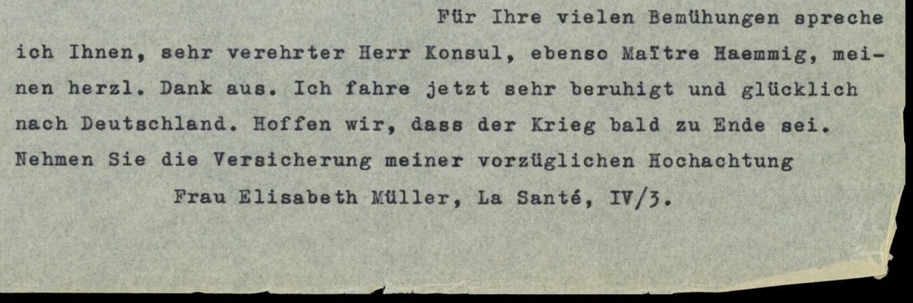

## 1. Video: Prozess im Haus der Chemie

▶️ **[Video auf Vimeo ansehen](https://vimeo.com/33125220>3)**

> **Kontext**: Der «Prozess im Haus der Chemie» fand vom 7. bis 14. April 1942 in Paris statt. Es war ein Schauprozess der deutschen Besatzungsmacht gegen 27 französische Widerstandskämpfer. Das Verfahren diente vor allem der Propaganda: Die Angeklagten wurden als «jüdisch-bolschewistische Terroristen» dargestellt. 7 Todesurteile wurden vollstreckt. Die Filmaufnahmen zeigen die inszenierte «Gerechtigkeit» der Besatzer — eine seltene visuelle Quelle.
> Hinweis: **Es handelt sich nicht um Elisabeth Müller im Film**.

🎬 [Vimeo: Akten in Bewegung](https://vimeo.com/331252203)

---

## 2. Bemühungen der Schweizer Behörden, eine Begnadigung zu bekommen

**Transkript**:
> Affaire Elisabeth Müller en instances auprès OKH Gerichtssachen Abteilung Gnadensuche

**Quelle**: BFS E4320B#1987/187#1705* «Müller, Elisabeth, 1896»

---

## 3. Gefangenenaustausch ? (17. April 1942)

**Transkript**:
> «...wäre es möglich, bei der zuständigen, deutschen Dienststelle einen Austausch mit einem deutschen Gefangenen in der Schweiz zu erzielen?»

**Quelle**: BFS E4320B#1987/187#1705* «Müller, Elisabeth, 1896»

---

## 4. «Beruhigt und glücklich» ? (17. April 1942)

**Transkript**:
> «Ich fahre jetzt sehr beruhigt und glücklich nach Deutschland. Hoffen wir, dass der Krieg bald zu Ende sei.»

**Quelle**: BFS E4320B#1987/187#1705* «Müller, Elisabeth, 1896»

---

---

← [Workflow I & II](04-workflow-i-ii-slide.html) · [Index](index.html) · [Demo — Was die Daten e...](07-demo-was-die-daten-enthuellen-slide.html) →

<small>Lizenz: [CC BY-NC-SA 4.0](https://creativecommons.org/licenses/by-nc-sa/4.0/)</small>
