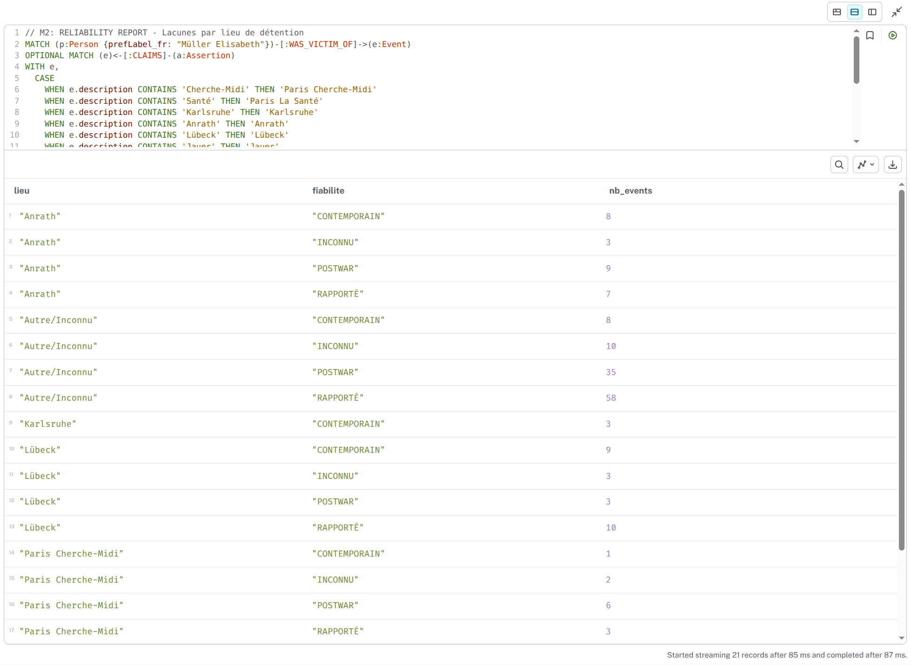
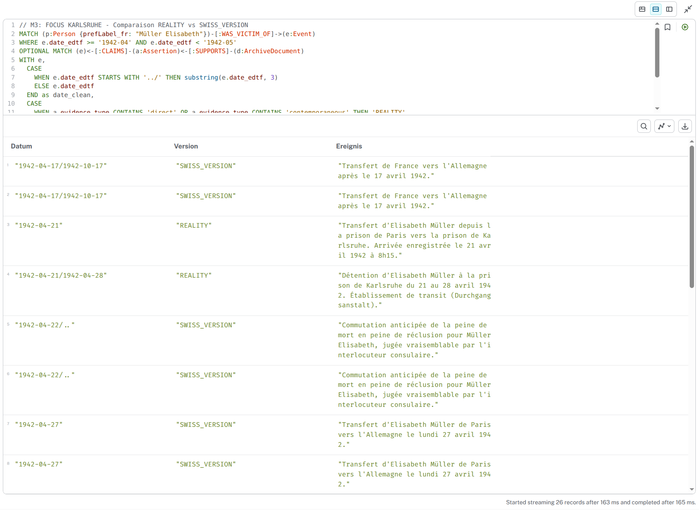
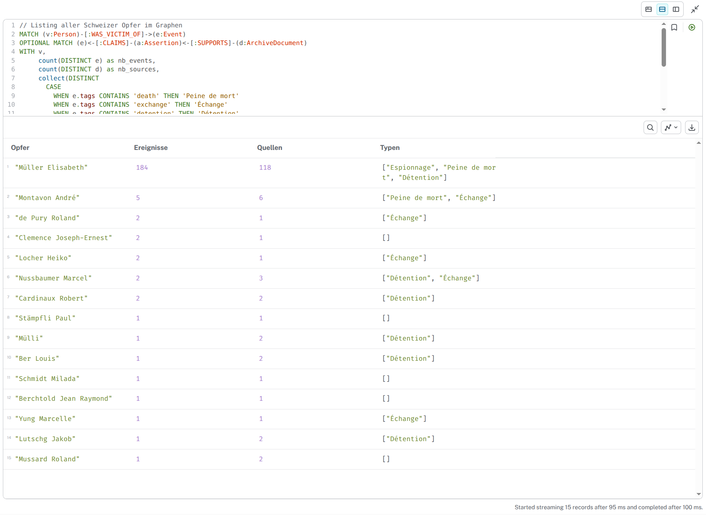
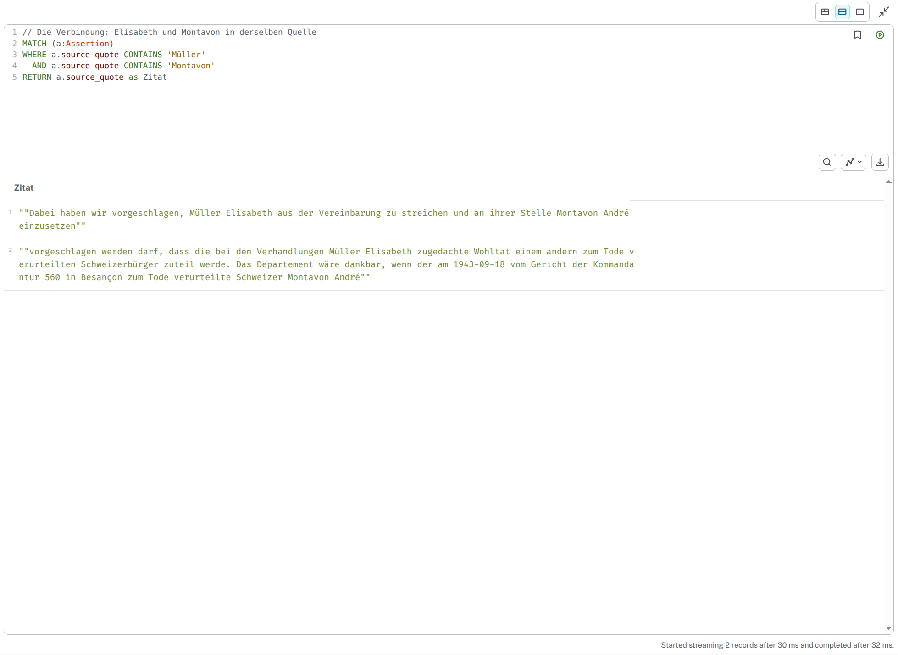
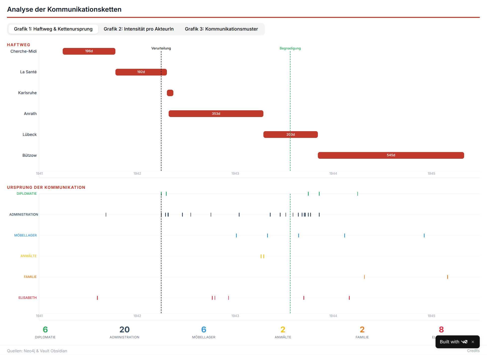
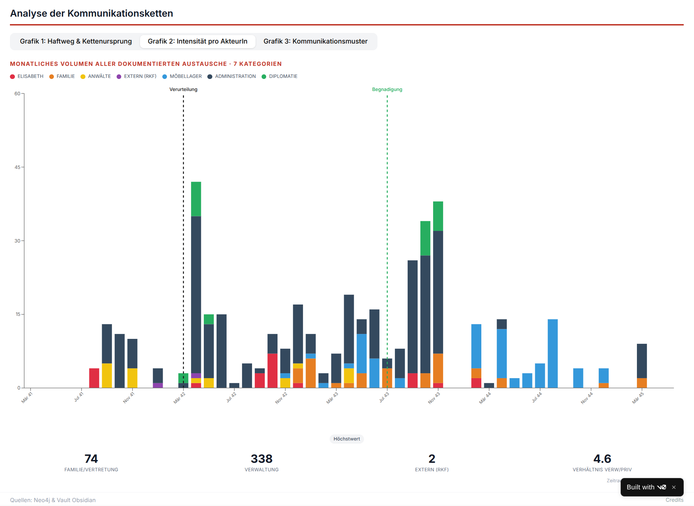
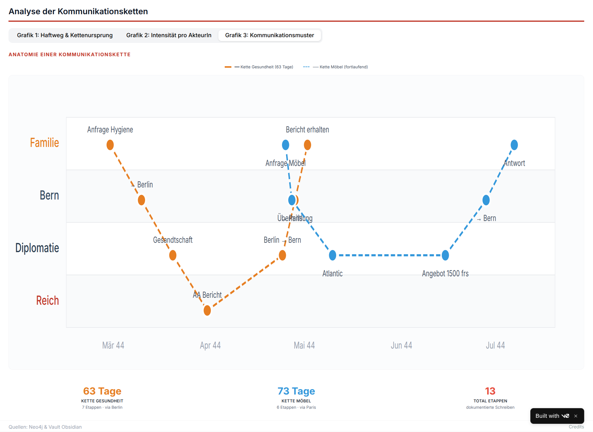

## Workflow: Von der Frage zur Visualisierung

> ℹ️ **Technische Pipeline**
> - **1. Fragestellung** → Claude Code als MCP-Server in Obsidian Vault
> - **2. Datenabfrage** → Agent verbindet sich mit Neo4j, schreibt Cypher-Queries
> - **3. Analyse** → Agent interpretiert Resultate, identifiziert Muster
> - **4. Visualisierung** → Datenexport zu v0.app für interaktive Grafiken
>
> 🔗 [Neo4j Aura](https://console.neo4j.io) · 🎨 [v0.app](https://v0.dev) · 📊 [Elisabeth-Visualisierung](https://v0-elisabeth2.vercel.app/)

---

## 1. Query M2: Zuverlässigkeit nach Haftort

> **Kontext**: Diese Query zeigt die Quellenqualität pro Gefängnis. Für Anrath und Lübeck gibt es eine gute Mischung aus CONTEMPORAIN (Vor-Ort-Quellen), RAPPORTÉ (Schweizer Berichte) und POSTWAR (Nachkriegszeugnisse). Für Karlsruhe: nur 3 CONTEMPORAIN-Einträge, kein einziger Schweizer Bericht. Die systematische Lücke wird sichtbar.

**Quelle**: Neo4j Graph-Datenbank, Cypher-Query auf Event- und Assertion-Nodes

---

## 2. Query M3: April 1942 — REALITY vs SWISS_VERSION

> **Kontext**: Direkter Vergleich der Realität (Gefängnisbücher) mit der Schweizer Sicht (diplomatische Berichte) im April 1942. Die REALITY-Spalte zeigt präzise Daten: Ankunft Karlsruhe am 21.04. um 8:15, Transfer nach Anrath am 28.04. um 9:00. Die SWISS_VERSION meldet erst am 27.04. «Transfert vers l'Allemagne» — 6 Tage nach der tatsächlichen Ankunft. Die Schweizer glauben zu wissen, wo Elisabeth ist. Sie irren sich.

**Quelle**: Neo4j Graph-Datenbank, Cypher-Query mit EDTF-Datumsfilter

---

## 3. Query 3: Alle Opfer im Graphen

> **Kontext**: Listing aller Schweizer Opfer mit Anzahl Ereignisse, Quellen und Falltypen. Elisabeth Müller dominiert mit 184 Ereignissen und 118 Quellen — das Resultat systematischer Archivarbeit. Montavon André erscheint mit 5 Ereignissen und dem Tag «Peine de mort». Eine Verbindung zeichnet sich ab.

**Quelle**: Neo4j Graph-Datenbank, Aggregation über Person-, Event- und ArchiveDocument-Nodes

---

## 4. Query 4: Die Verbindung Elisabeth–Montavon

> **Kontext**: Textsuche in allen Assertions nach «Müller» UND «Montavon». Zwei Treffer. Der entscheidende Satz: *«Wir haben vorgeschlagen, Müller Elisabeth aus der Vereinbarung zu streichen und an ihrer Stelle Montavon André einzusetzen.»* Elisabeth wurde zur Tauschwährung.

**Quelle**: Neo4j Graph-Datenbank, Volltextsuche in source_quote-Feld

---

## 5. Visualisierung 1: Kommunikationsursprünge

> **Kontext**: Timeline 1941–1945 mit Haftweg (oben) und Kommunikationsauslösern (unten). Die vertikalen gestrichelten Linien markieren Todesurteil (30.03.1942) und Begnadigung (24.07.1943). Die Behörden werden bei grossen Ereignissen aktiv — Verurteilung, Begnadigung, Austausch. Dazwischen: Stille. Behörden reagieren auf Schlagzeilen, nicht auf den Alltag der Haft.

**Quelle**: v0.app-Visualisierung basierend auf Neo4j-Export (412 Kommunikationsereignisse)

---

## 6. Visualisierung 2: Intensität nach AkteurIn

> **Kontext**: Balkendiagramm der Kommunikationsintensität. 338 Verwaltungsdokumente vs. 74 Familiendokumente (Verhältnis 4.6:1). Die blauen Balken: Möbellager-Korrespondenz (Maison Atlantique Transport, Paris). Elisabeths Möbel bleiben in Paris — alle 6 Monate die Frage: Wer zahlt? Die orangen Balken: Familie wird nach der Begnadigung aktiver. Der Sohn Hans-Rudolf übernimmt. Viel Volumen — aber viel davon ist Bürokratie.

**Quelle**: v0.app-Visualisierung basierend auf Neo4j-Export (Akteur-Kategorisierung)

---

## 7. Visualisierung 3: Anatomie einer Kommunikationskette 

> **Kontext**: Zwei parallele Kommunikationsketten 1944. Oben: Arztbesuch-Anfrage — 7 Etappen, 63 Tage. Familie → Bern → Berlin → Gefängnis → Arzt. Resultat: *«Bis auf harmlose Wechseljahrsbeschwerden ist der Gesundheitszustand der Müller Elisabeth gut.»* Niemand fragt nach. Unten: Möbelkette — 6 Etappen, 73 Tage. Bern erinnert an ausstehende Lagergebühren. Elisabeth kommt 1945 zurück: *«Körperlich und seelisch in sehr reduziertem Zustand.»* Lange Wege. Wenig Kontrolle. Falsches Vertrauen.

**Quelle**: v0.app-Visualisierung basierend auf Neo4j-Export (Kettenanalyse mit Zeitstempeln)

---

---

← [Paris 1942 — Das Todes...](06-paris-1942-das-todesurteil-slide.html) · [Index](index.html) · [Der Fehler, der Agent,...](08-der-fehler-der-agent-die-verschwundene-slide.html) →

<small>Lizenz: [CC BY-NC-SA 4.0](https://creativecommons.org/licenses/by-nc-sa/4.0/)</small>
