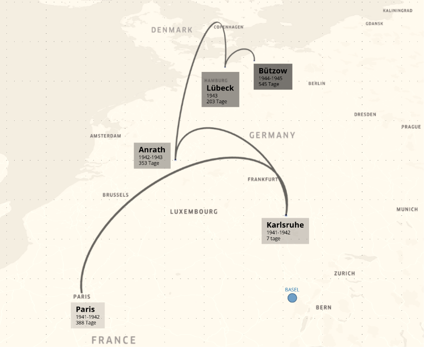
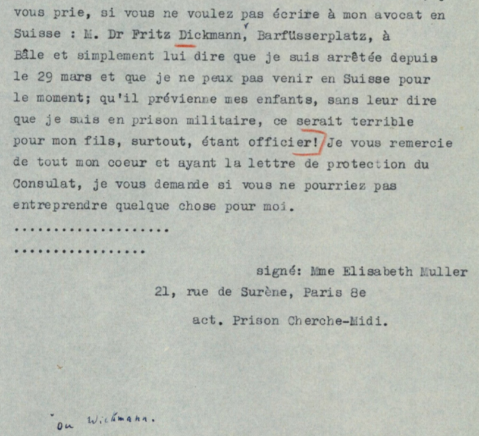
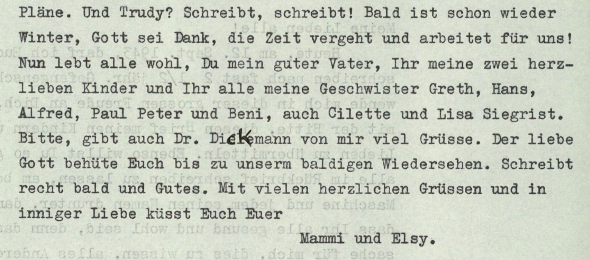
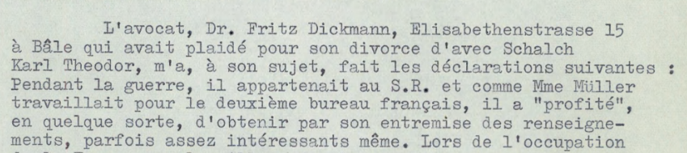
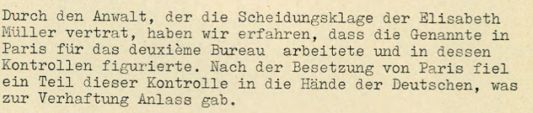
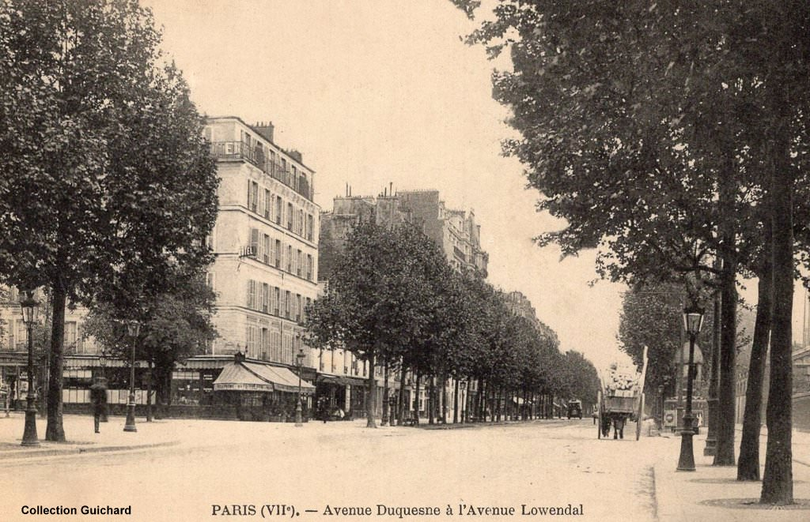

### 1. Rückblick — Karte Haftorte (1941–1945)

**Quelle**: Koordinaten aus Obsidian Vault (Metadaten Entities), durch Claude Code in CSV umgewandelt und in <https://kepler.gl/> visualisiert.

**Disclaimer**: Die Karte im Hintergrund ist keine historische Karte; sie dient nur der Veranschaulichung des Verfolgungswegs.

> **Kontext**: Sechs Orte. 1496 Tage Haft — vier Jahre, ein Monat. Paris (La Santé, Cherche-Midi) → Karlsruhe → Anrath → Lübeck → Bützow. 1945 von den sowjetischen Truppen befreit.

---

### 2. Der erste Fehler — Brief vom 4. August 1941

**Quelle**: Schweizerisches Bundesarchiv, E4320B#1987/187#1705*, Lettre d'Elisabeth Müller au Consulat de Suisse à Paris, 4 août 1941.

> **Kontext**: Elisabeth schreibt fehlerfrei mit der Maschine — ausser beim Namen ihres Anwalts: "Dick" oder "Wickmann". Die Schweizer Behörden suchen vergeblich nach einem ausländischen Agenten.

---

### 3. Der zweite Fehler — Brief vom 12. September 1943

**Quelle**: Schweizerisches Bundesarchiv, E4320B#1987/187#1705*, Lettre d'Elisabeth Müller à sa famille, 12 septembre 1943.

> **Kontext**: Nach zwei Jahren Schweigen darf Elisabeth wieder schreiben. Sie korrigiert den Namen von Hand: "Dickmann". Die einzige handschriftliche Korrektur im ganzen Brief.

---

### 4. Verhörprotokoll Fritz Dickmann — 7. September 1961

**Quelle**: Schweizerisches Bundesarchiv, E4320B#1987/187#1705*, Notice pour le dossier Müller Elisabeth, 7 septembre 1961.

> **Kontext**: Fritz Dickmann gibt zu Protokoll, dass er während des Krieges dem schweizerischen Nachrichtendienst angehörte und durch Elisabeth "profitierte, Informationen zu erhalten". Sein Name wird später mit dem Posten "Pelz" in Basel in Verbindung gebracht.

---

### 5. Offizieller Bericht der Kommission — 13. Februar 1962

**Quelle**: Schweizerisches Bundesarchiv, E4320B#1987/187#1705*, Ergänzungsbericht der Kommission für Vorauszahlungen, 13. Februar 1962.

> **Kontext**: Im offiziellen Bericht ist nur noch von "dem Anwalt" die Rede — ohne Namen, ohne Erwähnung seiner Tätigkeit für den Nachrichtendienst. Kein Wort davon.

---

### Elisabeth Müller. 1896. Baslerin.

**Quelle**: Postkarte ohne Datum, <https://www.cparama.com/forum/cartes2016/1476177866-RParis1-001.jpg> — PARIS (VII°), Avenue Duquesne bis Avenue Lowendal. Verlag: F. Fleury, Collection Guichard. Ungeprüft.

> **Kontext**: Hôtel Derby — Elisabeths Adresse von 1938 bis zur Verhaftung 1941. Direkt gegenüber der École Militaire. Als die Kommission 1960 die ehemaligen Besitzer befragt, erinnert sich niemand an eine Frau Müller.

---

---

← [Demo — Was die Daten e...](07-demo-was-die-daten-enthuellen-slide.html) · [Index](index.html) · [Diskussion — Graph bew...](09-diskussion-graph-bewahrt-llm-glaettet-slide.html) →

<small>Lizenz: [CC BY-NC-SA 4.0](https://creativecommons.org/licenses/by-nc-sa/4.0/)</small>
