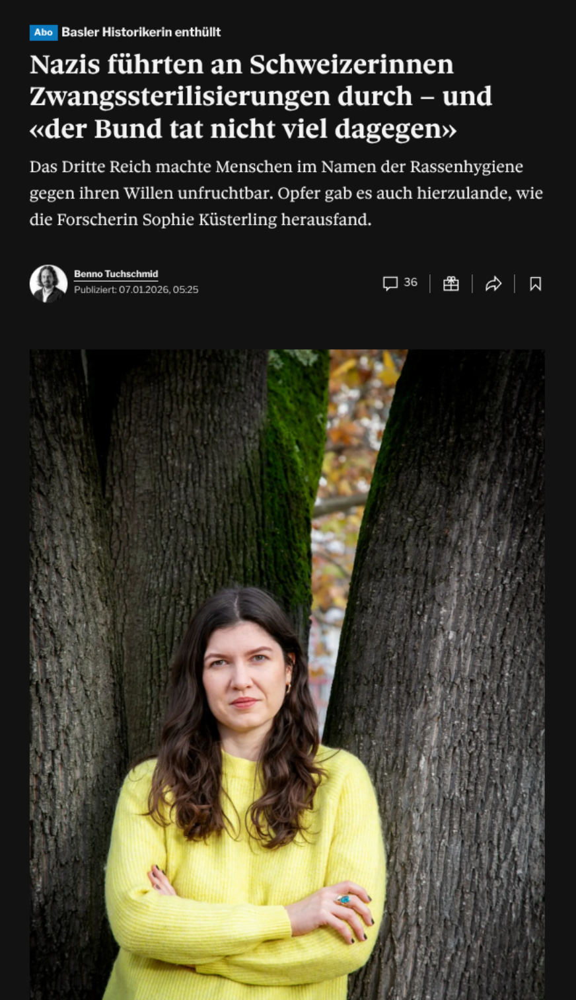
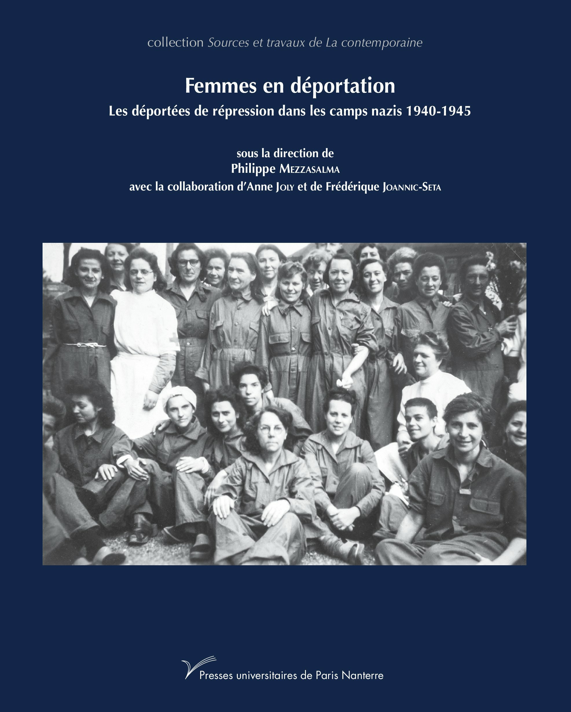

## Brandaktuell

> ⚠️ **Januar 2026**

| | |
|---|---|
| **Autorin** | Sophie Küsterling |
| **Titel** | *Nazis führten an Schweizerinnen Zwangssterilisierungen durch* |
| **Quelle** | Tagesanzeiger, 2025 |
| **Link** | [Artikel lesen](https://www.tagesanzeiger.ch/nazis-fuehrten-an-schweizerinnen-zwangssterilisierungen-durch-756801990605) |

---

## Historiografie — 3 aktuelle Werke

> 📄 **Weiterführende Literatur**

### Schweizer KZ-Häftlinge

| | |
|---|---|
| **Autoren** | Balz Spörri, René Staubli, Benno Tuchschmid |
| **Titel** | *Die Schweizer KZ-Häftlinge: vergessene Opfer des Dritten Reichs* |
| **Verlag** | NZZ Libro, Zürich, 2019 |
| **Link** | [NZZ Libro](https://www.nzz-libro.ch/die-schweizer-kz-haeftlinge-978-3-03810-436-0) |

---

### Femmes en déportation

| | |
|---|---|
| **Herausgeber** | Philippe Mezzasalma |
| **Titel** | *Femmes en déportation* |
| **Verlag** | Presses universitaires de Paris Nanterre, 2019 |
| **Link** | [OpenEdition Books](https://books.openedition.org/pupo/11780) |

---

### Nachrichtendienst Schweiz

| | |
|---|---|
| **Autor** | Christian Rossé |
| **Titel** | *Le Service de renseignements suisse face à la menace allemande, 1939-1945* |
| **Verlag** | Alphil, 2006 |
| **Link** | [Alphil](https://www.alphil.com/livres/41-46-le-service-de-renseignements-suisse-face-a-la-menace-allemande-1939-1945.html) |

---

## Starter Kit — Selbst experimentieren

> 📋 **Lokal. Kostenlos. Los!**

| Beschreibung                                                                            |                          Link                          |
| --------------------------------------------------------------------------------------- | :----------------------------------------------------: |
| **Obsidian** — Notizen, Wissensmanagement (agent client für die Integration mit LLM) |          [obsidian.md](https://obsidian.md/)           |
| **Neo4j Desktop** — Lokale Graph-Datenbank                                              |        [neo4j.com](https://neo4j.com/download/)        |

---

---

← [Diskussion — Graph bew...](09-diskussion-graph-bewahrt-llm-glaettet-slide.html) · [Index](index.html)

<small>Lizenz: [CC BY-NC-SA 4.0](https://creativecommons.org/licenses/by-nc-sa/4.0/)</small>
